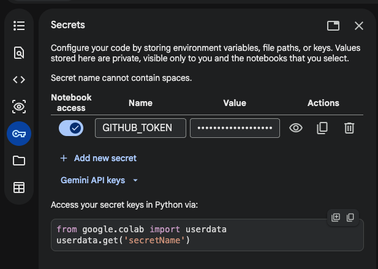

# Signal 38

> **The 38th parallel.** North Korean military activity risk analysis — fine-tuned LFM2-350M evaluated against naive and classical ML baselines on 11 years of GDELT data.

[](https://signal38.github.io)
[](https://www.python.org)
[](https://huggingface.co/LiquidAI/LFM2-350M)
[](https://huggingface.co/signal38)
[](https://www.gdeltproject.org)
[](LICENSE)

---

## What it does

Signal 38 ingests weekly clusters of GDELT v2 events involving North Korean military actors and produces structured risk assessments: escalation level (1–5), situation summary, key actors, watch indicators, and projected trajectories.

The landing page displays pre-computed assessments from the fine-tuned model on the held-out test set. LFM2's hybrid architecture is not yet supported by the ONNX/WebGPU browser stack — live inference is deferred.

## How it works

```
GDELT v2 events (11 years, NK military CAMEO codes)
  → weekly clusters (event counts, Goldstein scale, tone, actor codes)
  → Claude-labeled risk assessments (knowledge distillation)
  → three models evaluated:
      1. Naive baseline    — Goldstein-scale threshold rule
      2. Classical ML      — XGBoost on GDELT features
      3. LFM2-350M QLoRA  — fine-tuned on 463 labeled examples
  → LoRA adapter merged → pushed to HuggingFace Hub (signal38/lfm2-nk-risk)
```

## Models

| Model | Approach | Escalation MAE | Valid JSON |
|-------|----------|---------------|-----------|
| Naive baseline | Goldstein threshold rule | TBD | n/a |
| XGBoost | GDELT feature vector | TBD | n/a |
| LFM2-350M (fine-tuned) | QLoRA knowledge distillation | TBD | TBD |

*Results populated by `03_evaluate.ipynb` — see `data/outputs/results.json` and `data/outputs/test_predictions.json`.*

## Notebooks

Run in order. Notebooks 02–04 require a T4 GPU runtime. All publish their artifacts back to this repo automatically.

| Notebook | What it does | Runtime | |
|----------|-------------|---------|---|
| [`00_acled_labels.ipynb`](notebooks/00_acled_labels.ipynb) | ACLED ground truth labels (optional) | CPU, ~2 min | [](https://colab.research.google.com/github/signal38/signal38.github.io/blob/main/notebooks/00_acled_labels.ipynb) |
| [`01_baseline.ipynb`](notebooks/01_baseline.ipynb) | Naive rule + XGBoost baseline | CPU, ~5 min | [](https://colab.research.google.com/github/signal38/signal38.github.io/blob/main/notebooks/01_baseline.ipynb) |
| [`02_finetune.ipynb`](notebooks/02_finetune.ipynb) | LFM2-350M QLoRA fine-tuning | T4 GPU, ~20 min | [](https://colab.research.google.com/github/signal38/signal38.github.io/blob/main/notebooks/02_finetune.ipynb) |
| [`03_evaluate.ipynb`](notebooks/03_evaluate.ipynb) | Three-model evaluation + results export | T4 GPU, ~10 min | [](https://colab.research.google.com/github/signal38/signal38.github.io/blob/main/notebooks/03_evaluate.ipynb) |
| [`04_export_onnx.ipynb`](notebooks/04_export_onnx.ipynb) | Merge adapter → HuggingFace Hub | T4 GPU, ~10 min | [](https://colab.research.google.com/github/signal38/signal38.github.io/blob/main/notebooks/04_export_onnx.ipynb) |

## Repo structure

```
signal38.github.io/
├── notebooks/          # Colab-ready pipeline notebooks
├── scripts/            # Shared helpers (colab_utils, features, metrics)
├── src/                # App source (WebGPU inference, UI)
├── docs/               # GitHub Pages site
├── data/
│   ├── clusters/       # Weekly GDELT event clusters
│   ├── labeled/        # Claude-generated risk assessments
│   ├── training/       # Train / val / test splits
│   └── outputs/        # Evaluation results (published by notebooks)
└── models/             # LoRA adapter weights and ONNX export (published by notebooks 02, 04)
```

## Setup

```bash
pip install -r requirements.txt
```

Colab notebooks are self-contained. Open any notebook via the badge above, connect a T4 runtime, and run all cells.

## Colab setup

The notebooks share common setup via `scripts/colab_utils.py`. Notebooks that publish artifacts back to this repo require a `GITHUB_TOKEN_SIGNAL38` Colab secret. Notebook 00 additionally requires `ACLED_EMAIL` and `ACLED_PASSWORD`.

**Setting up the GitHub token (one-time):**

Create a [fine-grained personal access token](https://github.com/settings/tokens?type=beta) with **Contents: Read and Write** permission. When creating the token, set **Resource Owner** to `signal38` (the org) — the form defaults to your personal account, which produces a token with the wrong scope. Then add it to Colab: open the key icon in the left sidebar → **Secrets** → **Add new secret**, name it `GITHUB_TOKEN_SIGNAL38`, paste the token, and enable notebook access.



For ACLED credentials (notebook 00), register at [acleddata.com](https://acleddata.com/register/) and add `ACLED_EMAIL` and `ACLED_PASSWORD` as Colab secrets.

For HuggingFace Hub (notebook 04), create a write token at [huggingface.co/settings/tokens](https://huggingface.co/settings/tokens) and add it as `HF_TOKEN`.

## Team

- **Diya Mirji** — [@dvm14](https://github.com/dvm14)
- **Jonas Neves** — [@jonasneves](https://github.com/jonasneves)
- **Mike Saju** — [@Michaelsaju1](https://github.com/Michaelsaju1)

Built for **AIPI 540.01 — Deep Learning**, Spring 2026, Duke University AIPI Program.

## License

MIT
